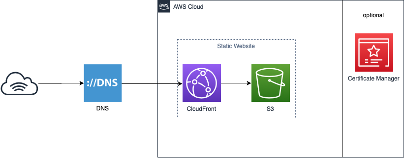

# Terraform for AWS Web

Run Terraform to deploy AWS service(s).  Use [CloudFront](https://aws.amazon.com/cloudfront/) and [S3](https://aws.amazon.com/s3/) handle website.

[Certificate Manager](https://aws.amazon.com/certificate-manager/) is optional for SSL.

## Structure



## Provider in Terraform Registry

[AWS Provider](https://registry.terraform.io/providers/hashicorp/aws/latest/docs)

## Environment variables

In **terraform.tfvars** or **example.tfvars**:

**profile** - (Required) configration of AWS credentials.

**region** - (Required) AWS region.

**s3_bucket** - (Required) An Amazon S3 bucket name is globally unique, and the namespace is shared by all AWS accounts.

**cloudfront_price_class** - (Required) Price class provides you an option to lower the prices you pay to deliver content out of Amazon CloudFront.

**domain_name** - (Optional) Provide domain name to bind on CloudFront.

**certificate_arn** - (Optional) The ARN of the AWS Certificate Manager certificate that you wish to use with this distribution. The ACM certificate must be in US-EAST-1.

## Usage

### Terraform Installation

Follow [this link](https://learn.hashicorp.com/tutorials/terraform/install-cli) in Terraform

### Prepare

Copy **example.tfvars** to **terraform.tfvars** and type variables depend on your environment

```
cp example.tfvars terraform.tfvars
```

### Initialize

Below command performs several different initialization steps in order to prepare a working directory for use. 

```
$ terraform init
```

### Deploy

Below command is used to apply the changes required to reach the desired state of the configuration, or the pre-determined set of actions generated by a terraform plan execution plan.

```
$ terraform apply
```